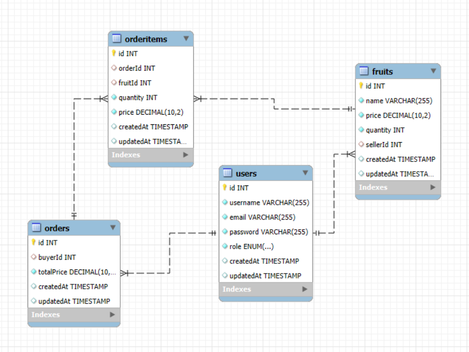

## Modelado de la Base de Datos

Para manejar los diferentes roles de usuarios (compradores y vendedores) y las operaciones sobre los productos (frutas), se propone la siguiente estructura de base de datos.

### Tablas Principales

1. **Usuarios (`Users`):**
   - **id**: Clave primaria, puede ser UUID o autoincremental.
   - **username**: Nombre de usuario único.
   - **email**: Correo electrónico único.
   - **password**: Contraseña encriptada.
   - **role**: Rol del usuario, puede ser `buyer` (comprador) o `seller` (vendedor).
   - **createdAt**: Fecha y hora de creación del registro.
   - **updatedAt**: Fecha y hora de la última actualización del registro.

2. **Frutas (`Fruits`):**
   - **id**: Clave primaria, puede ser UUID o autoincremental.
   - **name**: Nombre de la fruta.
   - **price**: Precio de la fruta.
   - **quantity**: Cantidad disponible de la fruta.
   - **imageUrl**: URL de la imagen de la fruta.
   - **sellerId**: Clave foránea que referencia al vendedor (`Users(id)`).
   - **createdAt**: Fecha y hora de creación del registro.
   - **updatedAt**: Fecha y hora de la última actualización del registro.

3. **Órdenes (`Orders`):**
   - **id**: Clave primaria, puede ser UUID o autoincremental.
   - **buyerId**: Clave foránea que referencia al comprador (`Users(id)`).
   - **totalPrice**: Precio total de la orden.
   - **createdAt**: Fecha y hora de creación del registro.
   - **updatedAt**: Fecha y hora de la última actualización del registro.

4. **Items de la Orden (`OrderItems`):**
   - **id**: Clave primaria, puede ser UUID o autoincremental.
   - **orderId**: Clave foránea que referencia a la orden (`Orders(id)`).
   - **fruitId**: Clave foránea que referencia a la fruta (`Fruits(id)`).
   - **quantity**: Cantidad de la fruta en la orden.
   - **price**: Precio de la fruta en la orden.
   - **createdAt**: Fecha y hora de creación del registro.
   - **updatedAt**: Fecha y hora de la última actualización del registro.

### Relaciones entre las Tablas

- **Usuarios (Users) y Frutas (Fruits):**
  - Un usuario con el rol de `seller` puede tener muchas frutas. Esta es una relación uno a muchos (1:n) entre `Users` y `Fruits`, donde cada fruta está asociada a un vendedor específico.

- **Órdenes (Orders) y Usuarios (Users):**
  - Un usuario con el rol de `buyer` puede realizar muchas órdenes. Esta es una relación uno a muchos (1:n) entre `Users` y `Orders`, donde cada orden está asociada a un comprador específico.

- **Órdenes (Orders) y Frutas (Fruits):**
  - Una orden puede contener muchas frutas, y cada fruta puede estar en muchas órdenes diferentes. Esta es una relación muchos a muchos (n:m) entre `Orders` y `Fruits`, gestionada a través de la tabla intermedia `OrderItems`.

### Resumen de Relaciones

- **Users -> Fruits:** Uno a muchos (1:n)
- **Users -> Orders:** Uno a muchos (1:n)
- **Orders -> Fruits:** Muchos a muchos (n:m) a través de `OrderItems`

# Modelo de Negocio: Tienda de Frutas en Línea

## Contexto del Negocio

La **Tienda de Frutas en Línea** es una plataforma digital que permite a vendedores de frutas ofrecer sus productos a una amplia base de clientes. Los clientes pueden navegar por la tienda, seleccionar las frutas que desean comprar y realizar pedidos que se entregarán a domicilio. La plataforma busca proporcionar una experiencia de compra fácil y segura tanto para los vendedores como para los compradores.

## Actores Principales

### 1. Vendedores (Sellers)
Los vendedores son usuarios que tienen la capacidad de listar frutas para la venta en la plataforma. Cada vendedor puede tener múltiples frutas disponibles, con detalles como el nombre del producto, el precio, y la cantidad disponible. Los vendedores gestionan su inventario y actualizan la información de sus productos según sea necesario.

### 2. Compradores (Buyers)
Los compradores son usuarios que navegan por la tienda en línea en busca de frutas para comprar. Pueden agregar múltiples productos a su carrito, visualizar los detalles de sus pedidos y realizar compras seguras a través de la plataforma. Cada comprador puede realizar varias órdenes a lo largo del tiempo.

## Entidades Principales

### 1. Usuarios (Users)
La entidad `Users` representa tanto a los compradores como a los vendedores en la plataforma. Cada usuario tiene un rol que determina su capacidad para listar productos o realizar compras. Los usuarios se registran en la plataforma proporcionando un nombre de usuario, un correo electrónico y una contraseña segura.

### 2. Frutas (Fruits)
Las `Fruits` son los productos que los vendedores listan en la plataforma. Cada fruta tiene un nombre, un precio y una cantidad disponible para la venta. Las frutas están directamente relacionadas con un vendedor específico, lo que permite a los compradores saber quién está ofreciendo cada producto.

### 3. Órdenes (Orders)
Las `Orders` representan las compras que los compradores realizan en la plataforma. Una orden puede contener varios ítems, cada uno representando una fruta diferente que el comprador ha decidido comprar. Las órdenes registran el total de la compra y están asociadas a un comprador.

### 4. Items de la Orden (OrderItems)
Los `OrderItems` son los elementos específicos dentro de una orden que detallan las frutas compradas, la cantidad de cada fruta y el precio correspondiente. Esta entidad conecta directamente las órdenes con las frutas, permitiendo a la plataforma gestionar compras compuestas.

## Relaciones y Flujos de Información

### Relación entre Usuarios y Frutas
Cada vendedor (usuario con rol de `seller`) puede listar múltiples frutas para la venta. Estas frutas están asociadas directamente con el vendedor que las ofrece. Los compradores (usuarios con rol de `buyer`) no pueden listar productos, pero pueden visualizar las frutas disponibles y seleccionarlas para su compra.

### Relación entre Compradores y Órdenes
Un comprador puede realizar múltiples órdenes a lo largo del tiempo. Cada orden está asociada con un comprador específico y contiene detalles como el total de la compra y los ítems individuales que componen la orden.

### Relación entre Órdenes y Frutas
A través de los `OrderItems`, cada orden puede estar asociada con múltiples frutas. Cada ítem en una orden especifica qué fruta se está comprando, cuántas unidades y el precio de esas unidades. Esto permite una granularidad en la gestión de las compras, permitiendo que una sola orden pueda contener diferentes tipos de frutas, cada una con su precio y cantidad específica.

## Flujo de Operaciones

### 1. Registro de Usuarios
Los nuevos usuarios se registran en la plataforma proporcionando un nombre de usuario, correo electrónico y contraseña. El usuario selecciona su rol como `buyer` (comprador) o `seller` (vendedor).

### 2. Listado de Productos
Los vendedores inician sesión en la plataforma y pueden listar nuevas frutas, especificando detalles como el nombre, precio y cantidad disponible. Estas frutas se muestran en la tienda para que los compradores las vean.

### 3. Navegación y Selección
Los compradores navegan por la tienda, viendo las frutas disponibles. Pueden agregar frutas a su carrito de compras, especificando la cantidad que desean comprar.

### 4. Realización de Órdenes
Una vez que el comprador ha seleccionado las frutas deseadas, procede a realizar una orden. La orden registra las frutas seleccionadas, la cantidad de cada una, y calcula el precio total. La orden se asocia directamente con el comprador que la realiza.

### 5. Gestión de Inventario
Después de que una orden se realiza, la cantidad de cada fruta en el inventario del vendedor se actualiza para reflejar la cantidad vendida. Si una fruta se agota, se marca como no disponible para futuras compras hasta que el vendedor actualice su inventario.

## Conclusión

El **Modelo de Negocio** de la Tienda de Frutas en Línea está diseñado para facilitar las transacciones entre vendedores y compradores de frutas, proporcionando una plataforma segura y eficiente para la gestión de productos, compras y entregas. A través de las entidades y relaciones descritas, la base de datos soporta todas las operaciones clave necesarias para el funcionamiento de la tienda, garantizando la integridad y disponibilidad de la información en todo momento.

